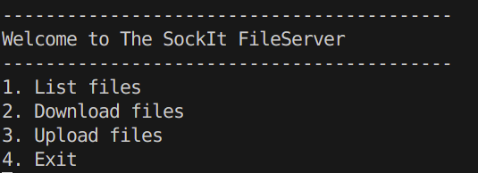

# SockIt

Sockit is a fileserver using custom created TCP sockets using C++

#Overview
SockIt is a terminal-based file sharing system built in C++. It allows file transfers over TCP sockets, supporting upload, download, and file listing. This project is developed in phases, starting with a single-client blocking model and later extending to multiclient support and GUI integration.

#System Architecture

[Terminal Client] ⇄ TCP Socket ⇄ [Terminal Server]

-Client: C++ terminal program that provides a menu and interacts with the user.

-Server: C++ terminal program that handles one client at a time, processes file commands, and manages files.

#Phase 1: Blocking Single-Client Model (Current phase)
Features Implemented

    -Establish TCP connection (client to server)

    -Handle one client at a time (blocking)

    -Support the LIST command:

        +Client sends LIST

        +Server responds with list of filenames in a shared directory

    -Simple line-based protocol

    -Graceful client disconnection (EXIT command)

#Commands & Protocol
-Client → Server

    LIST\n

-Server → Client

    file1.txt\n
    file2.jpg\n
    image.pdf\n
    EOF\n

    All messages are newline-terminated (\n)

    "EOF\n" marks end of file list

#Technologies Used

| Area       | Tool / API             | Notes                         |
| ---------- | ---------------------- | ----------------------------- |
| Networking | BSD Sockets / Winsock  | Blocking sockets              |
| File I/O   | `ifstream`, `ofstream` | Binary-safe operations        |
| Directory  | `<filesystem>` (C++17) | For `LIST` functionality      |
| CLI        | Standard input/output  | Text-based interface          |
| OS Support | Windows / Linux        | Platform-specific socket init |

#Folder Structure
/sockit/
├── server/
│ ├── basicServer.cpp # Testing entry point with menu loop
│ ├── menu.hpp # Menu, input handling (getch-style)
│ ├── file_server.cpp # Core server with sockets (to be built)
│ ├── server.hpp # Server socket setup and management
│ ├── client_handler.hpp # Handles client request routing
│ ├── file_ops.hpp # File I/O (upload/download handling)
│ └── server_files/ # Files stored or served
│
├── client/
│ └── file_client.cpp # Client for actual server (to be built)
│
├── shared/
│ ├── utils.hpp # Shared utilities (e.g., progress bar)
│ └── protocol.hpp # Text-based command protocol
│
├── logs/
│ └── server_log.txt # Optional logging
│
└── docs/
├── README.md # Project documentation
└── phase1_spec.md # Detailed planning

#User Experience

If user selects 3:

Sending command: LIST
Files on server:

- file1.txt
- file2.jpg
- image.pdf

#Checklist
| Task | Status |
| -------------------------------- | ------ |
| Basic TCP setup (client/server) | |
| Handle one client | |
| Parse `LIST` command | |
| Send list of files | |
| Add `EXIT` support | |
| Prevent crashes on invalid input | |
